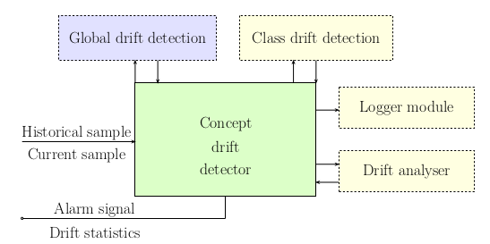

# Concept drift a distribution shift experiments

## Drift detector

The general overview of the drift detector infrastructure can be seen below The design of the drift detector is modular and some modules may be
used for further analysis. The detector may be tuned to the needs of the user by specifying the various modules. After the detector and its modules are initialised, the intended usage is to provide it with the historical and current data samples for a single round of drift detection. The primary and mandatory
module is the global drift detector, which provides the drifted features, drift strength and signal to retrain the model. Further analysis may be done by
running tests independently for each class and studying which classes are the most drifted. The drift analyser classifies the occurring drift into categories
to further explain how the distributions develop by running separate tests for its own time windows. Each of these modules may be configured to work with
different tests independently of each other. The logger module may be used to store the test results and prevent the need for outside monitoring of the detection results.



The following example describes how to use the drift detector to perform one
round of detection to compare two time windows of one dataset to analyse how
it evolves. Cesnet-QUIC dataset was used as an example, available through
their DataZoo platform, which is used as follows:

```python
from cesnet_datazoo.datasets import CESNET_QUIC22
from cesnet_datazoo.config import DatasetConfig

data = CESNET_QUIC22("../datasets/QUIC/", size="XS")

#Get the first week of data
dataset_config = DatasetConfig(dataset=data, train_period_name="W-2022-44",use_packet_histograms=True)
data.set_dataset_config_and_initialize(dataset_config)
data_ref = data.get_train_df(flatten_ppi=True)

#Get the second week of data
dataset_config = DatasetConfig(dataset=data, train_period_name="W-2022-45",use_packet_histograms=True)
data.set_dataset_config_and_initialize(dataset_config)
data_curr = data.get_train_df(flatten_ppi=True)
```

The process of initialising drift detector is done by supplying it with con-
figuration for the global detection test. Additionaly, one may supply the
configuration for the class-based test or use the Logger or Analyser mod-
ules. Only class-based test is showcased in this example, where one may use
different tests for the different detection modules.

```python
from detector.detector import DriftDetector, Config
from detector.test import KSTest, WassersteinTest

# Define the configuration of the global drift detection
global_config = Config(
    chosen_features = feat_names,
    #Optional parameter for the final weighning of the individual feature tests
    feature_importances = pd.Series(clf.feature_importances_,index = clf.feature_names_in_),
    drift_test=WassersteinTest()
)

# Define the configuration of the class -based drift detection
class_config = Config(
    chosen_features = feat_names,
    feature_importances = pd.Series(clf.feature_importances_,index = clf.feature_names_in_),
    drift_test=KSTest(),
    class_name="APP"
)

detector = DriftDetector(global_config, class_config)
```

The single round of drift detection is run as follows:

```python
detector.detect(data_ref,data_curr)
```

Each global statistic measured for the current round of detection can be returned in the following way. If one used the Analyser module, the inferred drift type would also be returned. This represents the same statistics that would be stored by the Logger module.

```python
detector.get_drift_statistics()
```

Even if no drift was discovered, some of the features could still be detected as drifted in their individual tests. They may be returned by calling:

```python
detector.get_drifted_features()
```

The class-based tests are run separately and their result may be obtained in this way. This presumes we have a way of obtaining the ground truth class labels, so it is intended to be used when analysing captured datasets. 

```python
detector.get_class_drift()
```

## Showcases

### Showcase_QUIC_analysis

* Analysis of CESNET_QUIC22 dataset
* Showcases how detector would be used for analysis of data from two time periods.

### Showcase_TLS_long_term

* Showcase of all the detector submodules
* Simulated model deployment and long term monitoring

## Experiments

### ALF_simulation_TLS_missclassified_analysis

* Schowcases how to simulate model deployment and drift detection guided model retraining
* The model behaviour and the differences between correctly classified and misclasified data samples get analysed
* Misclassifed samples seem to be mainly outliers, for example behaving differently then the current trend would dictate
* Other approaches should probably be used for data split into multiple models